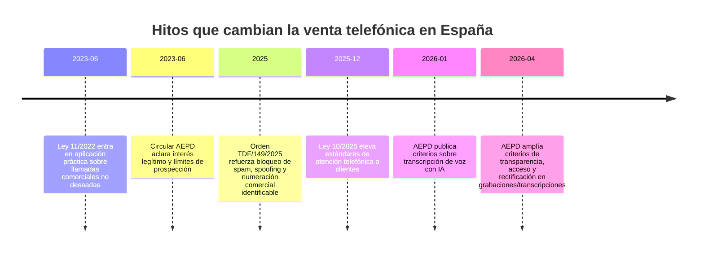
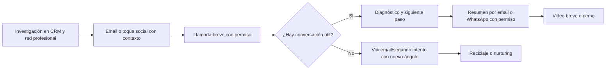
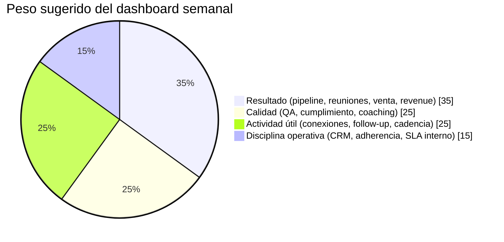

# La guía definitiva para el comercial telefónico en España 2026

## Resumen ejecutivo

La venta telefónica en España en 2026 ya no premia al comercial que “más aprieta”, sino al que mejor combina **cumplimiento**, **contexto**, **personalización** y **cadencia omnicanal**. El punto de inflexión fue doble: desde el **29 de junio de 2023** el derecho a no recibir llamadas comerciales no solicitadas se endureció con la Ley 11/2022 y la Circular de la entity["organization","Agencia Española de Protección de Datos","spain"], y en **2025** se reforzó el bloqueo de llamadas comerciales desde numeración móvil o manipulada mediante la Orden TDF/149/2025. En paralelo, España es un mercado muy maduro en mensajería, redes y nube: WhatsApp domina el uso cotidiano, las redes sociales siguen teniendo altísima penetración y las empresas usan cada vez más CRM, cloud e IA. Eso convierte al teléfono en el **centro conversacional** de una secuencia, no en el único canal. citeturn16search4turn5search14turn6search14turn1search1turn8view2turn19search1turn8view0turn9search0

La excelencia telefónica en España exige, además, una adaptación cultural fina. La literatura reciente sobre cultura organizacional española describe entornos donde pesan las **relaciones personales**, la **expresión emocional moderada**, la **explicación de los motivos** y un estilo de liderazgo más **participativo** de lo que muchos estereotipos sugieren; al mismo tiempo, conviene evitar simplificaciones folclóricas sobre horarios o “la siesta”. En la práctica, esto favorece aperturas más humanas, breves y honestas; preguntas que justifiquen el porqué de la llamada; y cierres centrados en el siguiente paso, no en la presión. citeturn37view0

Como no se ha fijado sector, tamaño de empresa ni complejidad de producto, esta guía asume **ausencia de restricciones específicas** y propone un modelo **transversal**. Cuando un consejo cambia según el contexto —por ejemplo, entre ticket bajo y venta enterprise, o entre captación B2B y cliente existente B2C— lo señalo expresamente. La tesis central es sencilla: en 2026, el gran comercial telefónico en España trabaja como un **diagnosticador de impacto**, no como un recitador de discurso; usa el teléfono para abrir o acelerar decisiones, no para bombardear; y se deja medir por resultados de negocio y por calidad operativa, pero sin caer en un control mecánico que erosione el rendimiento del equipo. citeturn39search10turn39search0turn39search1turn11view0turn11view4

## Marco legal y de cumplimiento

La arquitectura normativa mínima para vender por teléfono en España en 2026 combina **RGPD**, **LOPDGDD**, **LSSI-CE** y normativa de telecomunicaciones. En llamadas comerciales, el ancla práctica es el artículo 66.1 de la Ley 11/2022: los usuarios tienen derecho a no recibir llamadas comerciales no deseadas, salvo que exista consentimiento previo o que la comunicación pueda basarse en otra base legitimadora del artículo 6.1 del RGPD. La AEPD precisó en 2023 que el cambio de régimen era sustancial y que ya no basta con “no haberse opuesto”; como regla general, la Circular sitúa un terreno más sólido en clientes propios no opuestos o en contactos que hayan solicitado información o interactuado con la empresa durante el último año, siempre con ponderación documentada del interés legítimo. citeturn6search14turn16search4turn5search14turn0search0

Para correo electrónico, SMS o canales equivalentes —y en la práctica esto también afecta a muchos usos comerciales de WhatsApp— la LSSI sigue siendo más estricta: se prohíben las comunicaciones promocionales no solicitadas salvo autorización previa, con la excepción de la relación contractual previa para productos o servicios similares, siempre ofreciendo oposición sencilla y gratuita en la recogida del dato y en cada comunicación. La propia AEPD recuerda que el consentimiento debe ser un **acto afirmativo claro**, no una casilla tácita, no el silencio y no el “si no respondes, entendemos que aceptas”. citeturn6search0turn6search2turn31view2turn31view3turn5search1

La LOPDGDD añade una obligación operativa decisiva: antes de lanzar campañas de mercadotecnia directa hay que consultar los **sistemas de exclusión publicitaria** que puedan afectar a la campaña. La AEPD indica que la inscripción es gratuita, canalizable por medio, y efectiva desde el **segundo mes** posterior al alta; en su página pública remite, al menos, al **Servicio Lista Robinson** y a **Lista Stop Publicidad**. Para ventas telefónicas esto significa que la limpieza contra listas de exclusión no es un detalle administrativo: es un paso previo de la campaña y debe quedar trazado en el expediente de cumplimiento. citeturn31view3turn14search4turn14search2

Durante la llamada, la AEPD exige tres cosas básicas desde el primer segundo: identificar al empresario —y, si procede, a quién representa—, comunicar la finalidad comercial y explicar la posibilidad de **revocar el consentimiento** o ejercer el **derecho de oposición**. Cualquier negativa inequívoca debe atenderse inmediatamente, y la llamada debe grabarse como medio para demostrar cumplimiento. Si hay reclamación, la AEPD sólo puede actuar con elementos suficientes: número llamante, hora, grabación o indicio equivalente, identificación de la línea receptora y, en ciertos supuestos, prueba de inscripción en lista de exclusión o de retirada previa del consentimiento. citeturn31view0turn31view1

La normativa técnica de numeración también ha cambiado el terreno. La Orden TDF/149/2025 endureció el bloqueo de llamadas y SMS con numeración no atribuida o manipulada y reforzó el uso identificable de numeración para llamadas comerciales, con especial protagonismo de los rangos **800/900** para atención al cliente y comunicaciones comerciales. Traducido a operación: en 2026 un comercial serio no sale con móviles corrientes ni con numeración ambigua; eso dispara rechazo, riesgo reputacional y riesgo regulatorio. citeturn1search1turn0search11

A esto se añade una capa nueva si grabas, transcribes o analizas llamadas con IA. La AEPD ha recordado en 2026 que la voz y sus metadatos son datos personales, que hay que revisar diligentemente al proveedor, sus medidas de seguridad, plazos de conservación, localización de datos y tratamiento para reentrenamiento, y que funciones como la **detección de emociones** o la inferencia de categorías sensibles pueden quedar sometidas a un régimen muy estricto e incluso entrar en terrenos prohibidos por el Reglamento europeo de IA. También exige transparencia reforzada mientras la grabación está activa y mecanismos visibles o audibles que informen de ello. citeturn34view0turn34view1turn16search3turn32search0

La cronología regulatoria que realmente importa para un comercial telefónico hoy es esta. citeturn16search4turn5search14turn1search1turn30view0turn34view0turn34view1

La consecuencia práctica es que el **playbook legal** debe estar antes del playbook comercial. La tabla siguiente resume lo esencial.

| Regla | Qué exige en la práctica | Qué debe hacer el comercial o manager | Error típico que dispara rechazo o riesgo |
|---|---|---|---|
| Llamada no solicitada | Base jurídica válida; consentimiento o interés legítimo bien ponderado | Trabajar sólo listas con origen y base documentados | “Llamar por si cuela” |
| Inicio de llamada | Identidad, finalidad comercial, oposición/revocación | Apertura transparente en la primera frase | Ocultar quién llama |
| Oposición del destinatario | Atención inmediata | Marcar DNC interno en el acto y detener secuencia | “Te volveremos a llamar más adelante” |
| Exclusión publicitaria | Consulta previa de listas | Higienizar base antes de cargar al marcador | Saltarse Robinson/otras listas |
| Electrónico y WhatsApp | Opt-in o excepción de cliente previo y similaridad | Usar WhatsApp comercial sólo con permiso o base clara | Enviar mensajes fríos masivos |
| Grabación y QA | Demostrar cumplimiento y transparencia | Aviso de grabación; retención y acceso definidos | Grabar sin gobierno de datos |
| IA en llamadas | Diligencia reforzada sobre proveedor y riesgos | Validar DPA, SCC, localización, reentrenamiento, sesgos | Activar “emotion AI” alegremente |
| Numeración comercial | Identificación correcta y bloqueo del spoofing | Salir por numeración corporativa adecuada | Llamar desde móviles aleatorios |

La **checklist operativa** mínima, por tanto, es la siguiente: antes de la campaña, documenta origen del dato, base jurídica, consulta de exclusión, criterio horario, numeración y texto de apertura; durante la llamada, identifica, explica finalidad, da salida digna y registra oposición; después de la llamada, sincroniza CRM, clasifica la base jurídica del siguiente toque, limita el canal posterior al permitido y conserva la evidencia de cumplimiento. Todo lo demás es secundario. citeturn31view0turn31view1turn31view3turn34view1

## Cultura comercial española y diseño de la conversación

La cultura de negocios española no se debe caricaturizar, pero sí conviene entender algunos rasgos recurrentes. La revisión académica más reciente sobre cultura organizacional española dibuja un entorno donde importan las **relaciones personales**, se valora positivamente la **expresión de emociones y sentimientos**, la **comprensión** y el **afecto** en las relaciones, y existe una preferencia relativamente alta por estilos de liderazgo **carismáticos y participativos**. También se aprecia que en España se considera positivo **exponer las razones** de las decisiones y plantearlas abiertamente al superior o al equipo. Esa combinación tiene una implicación directa para el teléfono: en España suele funcionar mejor una llamada **clara, cercana y razonada** que una llamada hipermecanizada, impersonal o agresiva. citeturn37view0

La literatura también advierte contra los estereotipos fáciles. No conviene diseñar una estrategia basándose en tópicos sobre sobremesas eternas o reuniones caóticas, pero sí asumir que el contexto relacional pesa más que en otras culturas y que existe una cierta orientación **policrónica** del tiempo. Para el comercial esto significa dos cosas: primero, la llamada debe crear **permiso** y **contexto** antes de pedir acción; segundo, hay que respetar mucho más de lo que antes se hacía los horarios declarados, porque llamar fuera del contexto adecuado deteriora la percepción incluso antes de hablar de producto. citeturn37view0

De ahí salen cinco normas de diseño conversacional muy españolas y muy 2026. La primera es **honestidad inicial**: “te llamo por esto y tardo 30 segundos”. La segunda es **motivo concreto**, no slogan. La tercera es **diagnóstico antes que catálogo**. La cuarta es **tono sereno pero con energía**. La quinta es **cierre de microcompromiso**: siguiente paso pequeño, claro y pactado. Estas reglas encajan mejor con un mercado donde la confianza se gana rápido, pero se pierde aún más rápido si el vendedor suena invasivo o tramposo. citeturn37view0turn11view0turn38search17

La voz importa. La evidencia reciente en entornos de call center señala que un **tono afirmativo** y una **velocidad relativamente ágil** reducen insatisfacción y callbacks, mientras que ritmos demasiado lentos o demasiado rápidos empeoran la recepción. Mi recomendación operativa para España es un **ritmo vivo, no atropellado**, con pausas deliberadas después de cada pregunta importante y con una pronunciación especialmente limpia en nombre de empresa, motivo de llamada y propuesta de siguiente paso. citeturn38search4turn38search20

La frontera entre táctica moderna y táctica obsoleta queda así:

| Mantener | Por qué funciona | Excluir | Por qué genera rechazo |
|---|---|---|---|
| Apertura con permiso | Respeta contexto y baja defensas | Pitch de 45 segundos de salida | El prospecto desconecta antes de entender el valor |
| Personalización basada en hipótesis | Demuestra trabajo previo | Fingir familiaridad o inventar contexto | Rompe confianza al instante |
| Preguntas de impacto | Abren diagnóstico real | Interrogatorio mecánico de formulario | Suena a robot |
| Cierre al siguiente paso | Facilita avance sin presión | “¿Te cierro ya?” en llamada fría | Sube la resistencia |
| Cadencia teléfono + email + red + WhatsApp con permiso | Aprovecha hábitos reales de contacto | Bombardeo monocanal | Aumenta bloqueo y queja |
| Numeración corporativa identificable | Mejora respuesta y cumplimiento | Móviles aleatorios o números opacos | Rechazo instantáneo y riesgo regulatorio |
| IA para resumir y asistir | Reduce carga y acelera coaching | IA para analizar emociones sin gobierno | Riesgo legal y ético alto |
| Escucha activa con reformulación | Hace sentir comprendido | Interrumpir para “rebatir” | Se percibe agresivo |

## Prospección omnicanal y stack 2026

España es un mercado donde el teléfono tiene que convivir con mensajería, redes y herramientas de IA. Según la entity["organization","Comisión Nacional de los Mercados y la Competencia","spain"], **WhatsApp** fue en 2025 la aplicación preferida para mensajería (**93,8 %**) y también para llamadas online (**69,2 %**), y más del 80 % de los españoles enviaban varios mensajes al día desde el smartphone. La última edición del estudio de entity["organization","IAB Spain","spain"] sitúa el uso de redes sociales en el **86 %** de los internautas de 12 a 74 años, con WhatsApp, Instagram y YouTube dominando la relación con marcas y el proceso de compra. A la vez, el entity["organization","Instituto Nacional de Estadística","spain"] muestra que en 2025 el **34,5 %** de las empresas españolas de 10 o más empleados utilizaba CRM, el **44,3 %** cloud, el **21,1 %** IA y el **69,7 %** medios sociales. Dicho de otro modo: el comercial telefónico excelente en España 2026 trabaja desde un ecosistema digital ya suficientemente maduro para soportar un modelo omnicanal serio. citeturn8view2turn19search1turn8view0

La investigación de entity["company","McKinsey & Company","consulting firm"] sobre B2B refuerza esta idea: los decisores utilizan de media **10 canales** a lo largo del journey y el estándar de excelencia es una ejecución verdaderamente omnicanal. Además, informes comerciales recientes señalan que muchos vendedores siguen dedicando demasiado tiempo a tareas administrativas; por eso la IA bien gobernada no es un lujo, sino una forma de recuperar tiempo efectivo de conversación. citeturn17search7turn17search12

Mi secuencia recomendada para 2026 es esta: **investigación breve**, toque social o email de contexto si el caso lo permite, **llamada corta de apertura**, voicemail si no contesta, segundo intento telefónico con ángulo distinto, y sólo **WhatsApp** cuando exista permiso, relación previa o una base jurídica y política de canal muy claras. Tras una buena conversación, el teléfono debe dar paso a un resumen por email o mensajería, y si el avance requiere credibilidad visual o varios stakeholders, a una **videollamada corta**. La gran novedad es que el propio ecosistema oficial de WhatsApp ya permite integrar voz dentro de journeys empresariales mediante la **WhatsApp Business Calling API** anunciada en 2025. citeturn23search1turn23search8turn23search11

La secuencia ideal se parece a esto. Es una **propuesta operativa**, no una obligación regulatoria. La razón de fondo es combinar el canal más íntimo —la voz— con canales de refuerzo que el mercado español usa masivamente. citeturn8view2turn19search1turn17search7

La tabla de canales debería verse así:

| Canal | Papel principal | Cuándo usarlo | Ventaja | Riesgo si se usa mal |
|---|---|---|---|---|
| Teléfono | Abrir, diagnosticar, desbloquear | Primer contacto o follow-up crítico | Máxima riqueza conversacional | Invasión si no hay permiso/contexto |
| Email | Contextualizar y dejar rastro | Antes o después de llamada | Documenta valor y siguiente paso | Saturación y baja lectura |
| WhatsApp | Confirmar y acelerar | Sólo con permiso, relación previa o base clara | Altísima tasa de atención en España | Riesgo legal y sensación de intrusión |
| Red profesional | Preparar y calentar | Antes de la llamada | Reduce frialdad y mejora relevancia | Mensajes genéricos “plantilla” |
| Vídeo | Credibilidad y multistakeholder | Tras interés validado | Acelera confianza y claridad | Se pide demasiado pronto |
| IA asistiva | Resumen, scoring, coaching | Durante y tras la llamada | Ahorra tiempo y mejora consistencia | Mala gobernanza de datos |

En cuanto al stack, el criterio no es “comprar más”, sino comprar **lo justo para que el comercial llame mejor**. Para CRM generalista, los puntos de referencia visibles hoy son entity["company","HubSpot","crm software"], entity["company","Salesforce","crm software"], entity["company","Pipedrive","crm software"], entity["company","Zoho","crm software"] y entity["company","Microsoft","software company"] Dynamics 365; en telefonía/CCaaS, entity["company","Aircall","cloud telephony"], entity["company","JustCall","cloud telephony"], entity["company","Ringover","cloud telephony"] y la española entity["company","Numintec","contact center software"]; en mensajería y social selling, entity["company","WhatsApp","messaging platform"] Business Platform y entity["company","LinkedIn","professional network"] Sales Navigator. citeturn29search3turn28view1turn27view0turn28view5turn28view6turn21search1turn22search0turn28view3turn24search0turn24search2turn23search1turn18search2

### Comparativa de herramientas

| Capa | Herramienta | Lo mejor | Lo peor | Cuándo la elegiría |
|---|---|---|---|---|
| CRM | HubSpot Sales Hub | Muy rápido de implantar; fuerte en automatización y usabilidad; precios públicos desde nivel bajo | En niveles Pro/Enterprise el coste sube rápido y hay costes adicionales | Pymes y scale-ups que necesitan velocidad |
| CRM | Salesforce Sales Cloud | Muy potente, extensible y con ecosistema enorme; IA y datos unificados | Complejidad y coste altos si no hay disciplina de implantación | Mid-market y enterprise con procesos complejos |
| CRM | Pipedrive | Muy claro para pipeline y actividad; precios transparentes en euros | Menos robusto en enterprise complejo | Equipos hunters de pyme/SMB |
| CRM | Zoho CRM | Entrada muy asequible, incluso gratuita para 3 usuarios; ecosistema amplio | UX y gobierno algo más variables según configuración | Pyme sensible al coste |
| CRM | Dynamics 365 Sales | Muy buen encaje si el resto del stack es Microsoft | Requiere más gobierno y suele ser menos “plug and play” | Empresa muy metida en Microsoft 365/Power Platform |
| Telefonía/CCaaS | Aircall | Buen equilibrio de integraciones, Power Dialer y facilidad | Menos atractivo si quieres hiperpersonalización local | Ventas SMB/mid-market con HubSpot o Salesforce |
| Telefonía/CCaaS | JustCall | Dialers avanzados, IA asistiva y enfoque revenue | Parte del catálogo y precios se orienta a bundles/consumo | Equipos outbound con necesidad de productividad alta |
| Telefonía/CCaaS | Ringover | Buena propuesta europea y capa IA adicional | Hay que vigilar coste final con add-ons | Equipos europeos con foco en telefonía cloud |
| Telefonía/CCaaS | Numintec | Proveedor español, CCaaS, autodialer, scripting, analítica y WFM | Precio menos transparente públicamente | Operaciones que buscan cercanía local y soporte español |
| Mensajería | WhatsApp Business Platform | Canal masivo, API madura y posibilidad de journeys con voz | Gobernanza legal crítica; no vale para frío indiscriminado | Seguimiento, confirmación y soporte comercial |
| Social selling | LinkedIn Sales Navigator | Excelente para investigación y calentamiento B2B | Si se usa como spam, quema marca | ABM, B2B consultivo y prospección de cuentas |

La referencia pública visible hoy permite afirmar, por ejemplo, que Pipedrive publica planes desde **14 €** por usuario/mes al año, Dynamics 365 Sales Professional desde **56,30 €**, Aircall desde **30 $** por licencia/mes al año, JustCall desde **29 $** por usuario/mes y HubSpot muestra, según página oficial y materiales de producto, niveles desde **15 $** por asiento en Starter y **100 $** en Professional; en Salesforce los precios varían mucho según suite y edición, y la página europea muestra **Agentforce 1 Sales** en **550 €** por usuario/mes, aunque para small business también publicita niveles Starter más bajos. Úsalo como orientación inicial, no como presupuesto cerrado. citeturn27view0turn28view6turn21search1turn22search0turn29search3turn20search1turn20search21

## Método operativo de llamada, guiones y objeciones

La llamada excelente en 2026 no empieza vendiendo; empieza **diagnosticando si merece la pena seguir**. Para eso recomiendo una estructura breve, consistente y compatible con el contexto español: **permiso**, **hipótesis**, **diagnóstico**, **impacto**, **prueba**, **siguiente paso**. En productos simples se puede resolver en 3 a 5 minutos; en productos complejos, la primera llamada sirve sobre todo para obtener permiso a una conversación de descubrimiento más seria. La investigación reciente sobre adaptive selling sostiene precisamente que la capacidad de adaptar la conversación mejora tanto el rendimiento relacional como el rendimiento de ventas. citeturn11view0

### Plantilla de estructura de llamada

| Fase | Objetivo | Tiempo orientativo | Ejemplo |
|---|---|---:|---|
| Permiso | Bajar defensas y situar el marco | 15–20 s | “Te llamo por un motivo muy concreto; si no encaja, te dejo en paz en 20 segundos.” |
| Hipótesis | Mostrar que no llamas al azar | 20–30 s | “Estoy viendo empresas que tienen X y pierden Y por esto.” |
| Diagnóstico | Confirmar problema y prioridad | 60–120 s | “¿Cómo lo estáis resolviendo ahora y qué os está costando?” |
| Impacto | Cuantificar o cualificar el coste de no cambiar | 30–90 s | “Si eso sigue igual tres meses, ¿qué pasa?” |
| Prueba | Introducir credibilidad sin monólogo | 20–40 s | “Con equipos parecidos solemos reducir A o acelerar B.” |
| Siguiente paso | Cerrar microcompromiso claro | 20–30 s | “Si te parece, lo vemos 20 minutos el martes con tu responsable de…” |

### Aperturas, cierres y cualificación

BANT sigue sirviendo para venta de baja complejidad, pero se queda corto cuando hay varios decisores, ciclos largos o impacto económico difuso. Para 2026, mi recomendación general es esta: **BANT para transaccional**, **SPICED para discovery y handoff entre equipos**, y **MEDDPICC para deals complejos o enterprise**. El sistema Sandler sigue siendo muy útil cuando el problema real es que el comercial pierde el control del discovery o acepta oportunidades mal calificadas. citeturn39search2turn39search10turn39search0turn39search14turn39search1turn39search5turn39search22

| Framework | Mejor uso | Fortalezas | Límite principal |
|---|---|---|---|
| BANT | SMB y ticket bajo/medio | Rápido y fácil de enseñar | Superficial en compras complejas |
| SPICED | Descubrimiento consultivo y alineación RevOps/CS | Centrado en situación, dolor e impacto; gran handoff | Requiere reps que sepan preguntar de verdad |
| MEDDPICC | Enterprise y múltiples stakeholders | Muy potente para forecast y control de deal | Exige madurez operativa alta |
| Sandler | Equipos que preguntan mal o se precipitan | Excelente para discovery y control de proceso | Puede sonar artificial si se guioniza en exceso |

### Guiones modelo

**Guion de apertura fría B2B**  
“Hola, soy ___ de ___. Te llamo por algo muy concreto y, si no encaja, te libero en 20 segundos. Estoy viendo que muchas empresas de ___ están perdiendo tiempo comercial por ___, especialmente cuando ___. ¿Tiene sentido lo que te digo o te pillo totalmente fuera?”

**Guion de recuperación tras email/LinkedIn**  
“Hola, soy ___; te escribí ayer por ___ y no buscaba que me respondieras por escrito. Te llamo sólo para validar si el problema existe de verdad o si me he equivocado de arriba abajo.”

**Guion para lead entrante**  
“Gracias por pedir información. Antes de enseñarte nada, prefiero entender tres cosas: qué queréis resolver, qué impacto tiene hoy y quién debe validar una decisión así.”

**Guion de cierre a siguiente paso**  
“Ahora mismo no te propongo comprar nada. Sólo veo sentido a un siguiente paso si están contigo ___ y si en esa conversación podemos aterrizar ahorro/ingreso/tiempo en cifras o en proceso. Si no, mejor lo dejamos aquí.”

### Objeciones y respuestas recomendadas

| Objeción | Qué suele significar | Respuesta útil | Lo que no debes decir |
|---|---|---|---|
| “No me interesa.” | No ve relevancia aún | “Perfecto. Lo único que quiero validar es si el tema ni existe o simplemente no es prioridad.” | “Seguro que sí te interesa.” |
| “No tengo tiempo.” | Mala apertura o mal momento | “Lo entiendo. Dame 15 segundos para decirte el motivo y decides tú.” | “Sólo será un momento…” |
| “Envíame información.” | Quiere quitarse la llamada o pedir contexto | “Te la envío encantado, pero para no mandarte ruido: ¿qué de los tres puntos te interesa más?” | “Te mando un dossier y ya me dirás.” |
| “Ya trabajamos con otro.” | Hay solución instalada, no necesariamente satisfacción | “Tiene todo el sentido. Precisamente te llamo para ver si estáis razonablemente contentos o hay algo que seguís tolerando.” | “Seguro que somos mejores.” |
| “Estamos contentos.” | Barrera defensiva inicial | “Buena señal. Normalmente hablo con empresas contentas con el proveedor, pero no con la visibilidad o el tiempo de respuesta.” | “Pues deberíais comparar igualmente.” |
| “No hay presupuesto.” | No ve retorno o no hay partida actual | “Entiendo. ¿El problema no justifica presupuesto o simplemente no está abierto ahora?” | “Podemos ajustar precio.” |
| “Llámame más adelante.” | Timing incierto | “Sin problema. ¿Tiene más sentido por calendario, por prioridad o porque falta alguien en la conversación?” | “Te llamo en un par de meses.” |
| “No soy la persona.” | Gatekeeping o verdad parcial | “Gracias. ¿Quién lo mira realmente y cómo prefieres que llegue: referido por ti o directamente?” | “Pásame con dirección.” |
| “Mándamelo por WhatsApp.” | Señal de interés o comodidad | “Perfecto; te lo mando si te parece bien por ese canal. ¿Qué número prefieres y qué quieres que te resuma exactamente?” | Mandar un mensaje sin confirmar permiso ni contenido |
| “Es muy caro.” | Valor insuficientemente demostrado | “Puede ser. Frente a qué lo estás comparando: coste actual, alternativa o presupuesto ideal?” | “No lo es.” |
| “Ya lo hacemos internamente.” | Defensa de status quo | “Entonces la pregunta es si hacerlo dentro os sigue saliendo rentable en tiempo, calidad o foco.” | “Externalizar siempre es mejor.” |
| “No quiero cambiar ahora.” | Riesgo percibido | “Totalmente válido. ¿Qué tendría que pasar para que revisar esto sí mereciera la pena?” | “Si no cambias, te quedarás atrás.” |

## Gestión, KPIs, contratación y formación

La dirección de equipos de venta telefónica en 2026 debe evitar dos extremos: el management puramente emocional y el management puramente policíaco. La investigación sobre inside sales muestra que los managers usan tanto resultados de venta como resultados operativos de teléfono; pero también alerta de que una obsesión excesiva por el control operativo puede perjudicar el rendimiento y la satisfacción del agente. En paralelo, en España casi el **37,4 %** de las empresas de 10 o más empleados permite teletrabajo y el **20 %** de los empleados teletrabaja regularmente, así que el cuadro de mando debe estar pensado también para equipos distribuidos. citeturn11view4turn8view0

La clave es ponderar **actividad**, **calidad**, **pipeline** y **resultado**, no sólo volumen. La distribución visual que recomiendo para un dashboard semanal es ésta; es una propuesta de gestión, no un estándar legal. citeturn11view4turn11view0turn24search15

### KPIs y umbrales

| KPI | Qué mide | Frecuencia | Verde | Ámbar | Rojo |
|---|---|---|---|---|---|
| Contactabilidad | % de intentos que llegan a conversación | Diario | Sube semana a semana | Estable | Cae 2 semanas |
| Conversación útil | % de contactos con diagnóstico mínimo | Diario | > semana previa | Plano | Baja y sube volumen |
| Reunión válida / siguiente paso válido | Calidad del avance | Diario/semanal | Alta calidad y show-rate sólido | Hay reuniones pero flojas | Muchas reuniones “de relleno” |
| Tiempo a primer follow-up | Velocidad comercial | Diario | Mismo día o SLA definido | 24–48 h | >48 h |
| Conversión por lista/canal | Calidad del origen | Semanal | Se distinguen claramente ganadores | Mezcla difusa | No se sabe qué funciona |
| Win rate por origen | Eficacia real | Mensual | Mejora o se mantiene sana | Estable | Cae sin explicación |
| Cobertura de QA | % de llamadas auditadas con coaching | Semanal | 3–5 llamadas útiles/rep | 1–2 | 0 o puro checklist |
| Oposición / queja / DNC | Riesgo y experiencia | Diario | Muy baja y trazada | Requiere revisión | Crece o no se registra |
| Higiene CRM | Completitud de campos críticos | Diario | >95 % | 85–95 % | <85 % |
| Adherencia remota | Cumplimiento de bloques y disponibilidad | Diario | Alta y estable | Fluctúa | Se desordena la agenda |

Para equipos remotos añadiría cuatro métricas más: **latencia de registro en CRM**, **tiempo entre actividad y actualización**, **uso de bloques de trabajo protegidos** y **ratio coaching/apagafuegos** del manager. Un equipo remoto sano deja rastro limpio, hace follow-up rápido y no depende de perseguir a la gente por chat para saber qué ha pasado. Eso no es microgestión; es operativa básica. citeturn11view4turn8view0

### Perfil de contratación y matriz de competencias

| Perfil | Misión | Competencias críticas | Señales de alta probabilidad | Señales de riesgo |
|---|---|---|---|---|
| SDR / prospector | Abrir conversaciones válidas | Apertura, resiliencia, escucha, escritura breve | Capaz de resumir en 20 segundos; no se hunde con el no | Habla mucho y escucha poco |
| AE telefónico / closer remoto | Diagnosticar y cerrar | Discovery, negocio, manejo de objeciones, cierre | Convierte problemas en impacto y siguientes pasos | Hace demos demasiado pronto |
| Farmer / upsell / renovación | Expandir y retener | Relación, timing, lectura política, negociación | Conecta uso, valor y renovación | Llama sólo cuando toca renovar |
| Team lead | Mejorar sistema y personas | Coaching, QA, forecast, disciplina comercial | Corrige comportamientos, no sólo cifras | Gestiona por bronca o Excel |

La matriz que más me gusta para seleccionar es de ocho competencias, puntuadas de 1 a 5: claridad verbal, escucha, pensamiento estructurado, curiosidad comercial, tolerancia al rechazo, organización, ética/compliance y adaptabilidad. El umbral de entrada no es “vende mucho”; es “**aprende rápido, pregunta bien y aguanta bien**”. La evidencia sobre adaptive selling hace especialmente valiosas la mentalización interpersonal y la capacidad de ajustar el discurso al interlocutor. citeturn11view0

### Currículum de formación y role-plays

| Bloque | Objetivo | Ejercicios |
|---|---|---|
| Fundamentos legales | Que nadie queme la marca ni la base de datos | Aperturas compliance; registro de oposición; checklist DNC |
| Voz y apertura | Mejorar primeros 30 segundos | 20 aperturas grabadas; comparación de tono y ritmo |
| Discovery | Pasar de pregunta superficial a impacto | Role-play de dolor, coste, urgencia y decisor |
| Objeciones | Responder sin discutir | Circuito de 12 objeciones cronometradas |
| Omnicanal | Coordinar teléfono, email, red y WhatsApp | Secuencia de 5 toques por ICP |
| CRM y disciplina | Convertir actividad en dato útil | Registro limpio de llamadas y siguientes pasos |
| IA y QA | Aprender de llamadas reales | Resumen asistido, autoevaluación y plan de mejora |
| Negociación y cierre | Pedir compromiso sin agresividad | Cierres a reunión, cierre a piloto y cierre a no-avance |

El plan de ramp-up razonable es **30-60-90 días**: en los primeros 30, mucha base legal, voz y apertura; en los 60, discovery y objeciones; en los 90, forecast, cualificación y especialización por vertical o tipo de cuenta. La revisión semanal ideal mezcla grabaciones, métricas y role-play, porque ni el dato sin llamada ni la llamada sin dato corrigen comportamiento de forma fiable. citeturn11view0turn11view4

## Transcripciones modelo y casos españoles

Los guiones anteriores sirven de estructura; las siguientes cinco conversaciones sirven para aterrizar tono, ritmo y decisiones. Son **simulaciones prácticas** adaptables asectores distintos.

### Transcripción de llamada fría B2B con cierre a reunión

**Comercial:** Buenos días, ¿soy yo quien lleva la parte comercial o de operaciones? Soy Marta, de Vela. Te llamo por algo muy concreto y, si no aplica, en 20 segundos te dejo.  
**Cliente:** Dime.  
**Comercial:** Estoy hablando con empresas que tienen entre 5 y 20 comerciales y siguen haciendo seguimiento en varias herramientas. Eso suele traducirse en oportunidades frías y bastante tiempo perdido. ¿Te suena o voy desencaminada?  
**Cliente:** Bueno, algo de eso hay.  
**Comercial:** Perfecto. No te voy a vender nada ahora. Sólo quiero entender una cosa: ¿el problema es más de visibilidad del pipeline o más de disciplina del equipo?  
**Cliente:** Más bien disciplina.  
**Comercial:** Tiene sentido. Cuando pasa eso, ¿qué duele más: reuniones sin preparar, propuestas que llegan tarde o seguimiento que se cae?  
**Cliente:** Seguimiento.  
**Comercial:** Vale. Si eso os sigue pasando este trimestre, ¿qué impacto tiene: menos cierre, más sensación de caos o ambas?  
**Cliente:** Ambas.  
**Comercial:** Ahí solemos ayudar. En empresas parecidas, el primer cambio no es tecnológico; es de proceso y seguimiento visible. Si te parece, en vez de contártelo por teléfono, vemos en 20 minutos cómo lo estáis trabajando hoy y te digo con honestidad si hay encaje o no. ¿Te encaja mejor martes o miércoles?  
**Cliente:** Miércoles a las 12.  
**Comercial:** Perfecto. ¿Quién más debería estar para que la conversación sirva de verdad?  
**Cliente:** Nuestro responsable comercial.  
**Comercial:** Estupendo. Te mando convocatoria con tres puntos concretos y, si ves que no tiene sentido antes de entrar, me lo dices sin problema.

### Transcripción de lead entrante con cualificación

**Comercial:** Hola, Javier. Soy Laura. Has pedido información en la web hace un rato. ¿Te viene bien ahora dos minutos?  
**Cliente:** Sí, dime.  
**Comercial:** Gracias. Para no enseñarte una demo que no te sirva, necesito entender tres cosas. La primera: ¿qué queréis resolver exactamente?  
**Cliente:** Centralizar llamadas y WhatsApp.  
**Comercial:** Perfecto. Segunda: hoy, ¿qué está pasando para que esto os preocupe ahora?  
**Cliente:** Que se nos quedan mensajes sin responder y no sabemos quién habló con quién.  
**Comercial:** Bien concreto. Y tercera: ¿quién valida una decisión así y en qué plazo queréis moverlo?  
**Cliente:** Lo vemos mi socio y yo; nos gustaría cerrarlo este mes.  
**Comercial:** Entonces sí tiene sentido avanzar. Lo que haría sería una demo centrada sólo en tres cosas: reparto de conversaciones, trazabilidad y seguimiento. Si en esa demo no ves que eso mejora vuestra operativa, no seguimos. ¿Mañana por la mañana o por la tarde?  
**Cliente:** Mañana por la tarde.

### Transcripción de objeción dura de precio

**Comercial:** Por lo que me cuentas, el problema os cuesta tiempo y pérdida de oportunidades. La propuesta sería ésta.  
**Cliente:** Ya, pero es caro.  
**Comercial:** Puede ser. Para entendernos bien: ¿caro respecto a qué?  
**Cliente:** Respecto a lo que pensábamos gastar.  
**Comercial:** Perfecto; entonces el tema no es si aporta valor, sino cómo encaja con la partida. Si lo viéramos sólo como ahorro de tiempo del equipo, seguramente no saldría. Si lo medimos por oportunidades recuperadas y respuesta más rápida, cambia. ¿Te cuadra que hagamos esa cuenta juntos antes de descartarlo?  
**Cliente:** Sí, eso sí.  
**Comercial:** Genial. Entonces no defendamos el precio todavía; defendamos si el retorno existe. Si no existe, no quiero que lo compres.

### Transcripción de renovación y upsell con cliente existente

**Comercial:** Hola, Ana. Te llamo porque entramos en ventana de renovación y prefiero no hacer la típica llamada administrativa. Quiero revisar uso, valor y si tiene sentido ampliar o incluso simplificar.  
**Cliente:** Me parece bien.  
**Comercial:** En estos meses habéis mejorado muchísimo en tiempos de respuesta, pero veo que sólo parte del equipo usa la parte de automatización. ¿Es porque no lo necesitan o porque no terminamos de implantarlo?  
**Cliente:** Más bien lo segundo.  
**Comercial:** Entendido. Entonces yo no te propondría ampliar sin más. Haría dos cosas: plan corto de adopción de 30 días y, si después sigue habiendo carga manual, activaríamos el módulo adicional. Así no pagas por algo que no vais a usar.  
**Cliente:** Eso me gusta más.  
**Comercial:** Perfecto. Mi objetivo aquí es que renueves con sentido, no venderte una licencia por venderla.

### Transcripción de seguimiento tras contacto en red profesional y permiso para WhatsApp

**Comercial:** Hola, Pablo. Soy Sergio. Te escribí por LinkedIn sobre la parte de seguimiento comercial. No te llamo para leerte el mensaje; sólo para saber si el problema existe o si me equivoqué de arriba abajo.  
**Cliente:** Algo de eso sí hay, pero ahora mismo voy fatal.  
**Comercial:** Lo entiendo. Te propongo una salida fácil: dime si la prioridad está en seguimiento, reporting o adopción del equipo y te dejo un resumen por el canal que prefieras.  
**Cliente:** Seguimiento.  
**Comercial:** Perfecto. Si te viene bien, te dejo dos ideas por WhatsApp y, si tienen sentido, ya agendamos. ¿Te encaja que te escriba por ahí?  
**Cliente:** Sí, mejor.  
**Comercial:** Fenomenal. Te envío sólo un resumen breve, sin spam, y si no ves encaje me lo dices y no insisto.

### Casos y lecciones en España entre 2023 y 2026

| Caso | Qué pasó | Lección para ventas telefónicas |
|---|---|---|
| Giro regulatorio de 2023 | La venta por llamada no puede apoyarse ya en la pura inercia del “si no se opuso” | La base jurídica hay que diseñarla antes de marcar |
| Expedientes AEPD 2024-2025 | Muchas reclamaciones dependen de pruebas de llamada, oposición y trazabilidad | Graba, registra y sincroniza; si no, no podrás defender tu operación |
| Reforma anti-spam 2025 | Se endurece la identificación de llamadas comerciales y el bloqueo del spoofing | El número ya vende o destruye antes de hablar |
| Atención a la clientela 2025-2026 | Sube el estándar de calidad telefónica, accesibilidad y atención personalizada | Cualquier equipo que también atienda clientes debe separar bien venta, soporte y queja |

Estos casos se apoyan en la entrada en vigor del nuevo régimen de llamadas comerciales, los criterios de la AEPD sobre prueba y oposición, la Orden TDF/149/2025 y la Ley 10/2025 sobre atención a la clientela. citeturn16search4turn31view0turn31view1turn1search1turn30view0turn13search11

La conclusión de fondo es que el modelo ganador en España ya no es el del “call center de martillo”. Es el de **comercial telefónico consultivo, muy disciplinado en cumplimiento, intensivo en CRM, apoyado en IA asistiva, cómodo trabajando en varias capas de canal y capaz de sonar humano sin perder estructura**. La llamada fría pura sigue existiendo, pero cada vez funciona mejor cuando está **calentada** por contexto, hipótesis y timing, y peor cuando depende sólo de volumen. Eso no es una cuestión de moda; es la intersección entre regulación, cultura y madurez digital del mercado español. citeturn17search7turn8view2turn19search1turn8view0turn11view0turn11view4

## Preguntas abiertas y límites

Hay tres zonas donde conviene no sobregeneralizar. La primera es sectorial: finanzas, seguros, energía, salud y servicios regulados pueden añadir obligaciones específicas no desarrolladas aquí. La segunda es económica: los umbrales de KPI y la elección de framework cambian bastante según ticket medio, longitud del ciclo y calidad de la base de datos. La tercera es tecnológica: los precios y empaquetados de software cambian con frecuencia, así que conviene validar la página oficial antes de contratar. El criterio correcto no es perseguir el “stack perfecto”, sino asegurar que cada herramienta mejora una fase concreta del sistema comercial y que su uso es compatible con RGPD, gobierno de datos y prácticas aceptables para el mercado español. citeturn34view0turn34view1turn27view0turn28view6turn21search1turn22search0